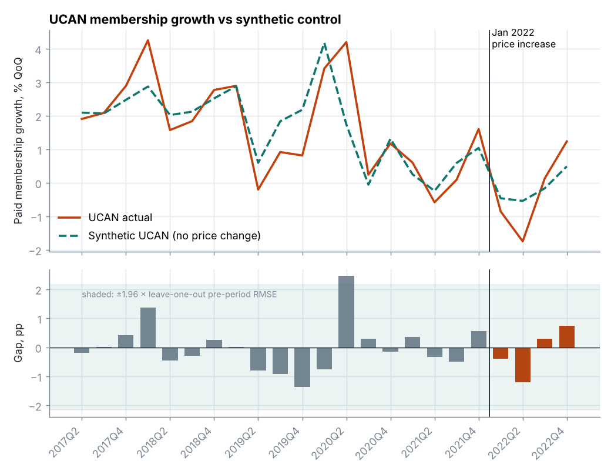
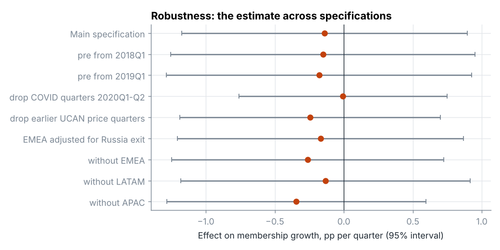
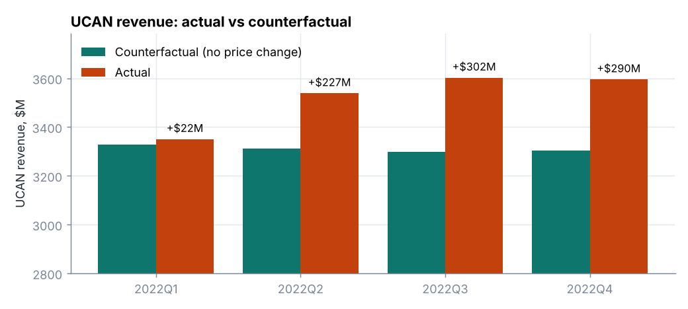
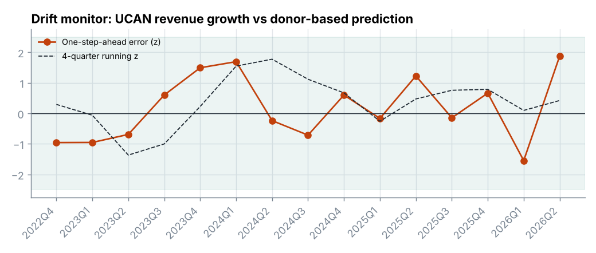

# Did Netflix's 2022 price increase cost it members? A counterfactual pricing study

**Question.** In January 2022 Netflix raised US and Canada (UCAN) prices by about 11%. Did that change retention and revenue, compared with what would have happened without it?

**Answer.** Realised revenue per member rose 9.5%. The membership base ended 2022 an estimated 0.6% below its no-price-change path, which is not distinguishable from zero (95% interval −4.7% to +3.6%). The dip was concentrated in the first two quarters (−1.6%) and had mostly closed by year end. The implied price elasticity is −0.06 over four quarters (interval −0.49 to +0.38): demand was inelastic. The increase added an estimated $842M (+6.4%) to 2022 UCAN revenue.

The membership effect is a null result with a wide interval, and the README says so throughout. What the data do support is a bound: elasticity was very unlikely to be below about −0.5, and at that bound the price increase still paid.



## Is any of this synthetic?

**No data in this repository is synthetic.** Every number in `data/raw/` was transcribed from a Netflix SEC filing, and each row carries its source URL.

Three things are *not* data and should not be read as Netflix facts:

| Item | What it is |
|---|---|
| Counterfactual ("synthetic UCAN") series | A model estimate. "Synthetic control" is the name of the method. |
| Monthly churn, gross additions, price flow-through, discount rate | Assumptions set in `config.yaml`. Netflix does not disclose churn or gross additions. |
| `backfill` rows in `registry/runs.csv` and `MAINTENANCE_LOG.md` | Replays of past quarters, all executed on 2026-10-06 to test the monitoring logic. They are not evidence the job ran at those dates. |

Unit tests use small simulated panels to check that the estimator recovers a planted effect. Those never touch the results.

Two rows of `data/raw/price_events.csv` (the 2019 and 2020 UCAN list prices) come from memory of press coverage and are flagged `verified_in_build = no`. They are used only to name quarters to drop in one robustness check. Check them before citing.

## Data

| File | Content | Source |
|---|---|---|
| `netflix_regional_quarterly.csv` | Revenue, paid memberships, net additions, ARM for UCAN, EMEA, LATAM, APAC. 2017Q1–2024Q4 complete; 2025Q1–2026Q2 revenue only. | Netflix 8-K of 16 Dec 2019 and Q4 shareholder letters (EDGAR) |
| `price_events.csv` | List prices before and after each UCAN change | Press reports |
| `netflix_income_statement.csv` | Revenue and cost lines, 2022–2024 | 2024 Form 10-K |

Netflix stopped reporting memberships and ARM after 2024Q4. The causal study therefore uses 2017–2022, and the live monitor uses regional revenue, which is still published.

Two accounting identities are checked on every run: memberships reconcile to net additions, and revenue reconciles to ARM × average memberships × 3 within 1%. Both hold for all 128 membership rows.

## Method

**Outcome.** Quarter-on-quarter growth in paid memberships (net additions ÷ prior base). Netflix publishes no churn series, so net membership growth is the closest public measure of retention. It mixes cancellations with fewer sign-ups; the two cannot be separated with this data.

**Treated unit and donors.** UCAN is treated from 2022Q1. EMEA, LATAM and APAC are donors. Post window: 2022Q1–Q4, which ends before paid sharing reached UCAN in 2023.

**Why not plain difference-in-differences.** Equal-weight DiD gives +3.5 pp per quarter, implying the price increase *raised* growth. That is an artefact. The other regions were growing much faster than UCAN and decelerating toward it, so the pre-period gap trends upward and parallel trends fails (`outputs/figures/did_pretrend.png`). Adding a linear trend to the gap moves the estimate to +0.08 (SE 1.10); adding seasonality, −0.12 (SE 1.23).

**Why not standard synthetic control.** It needs the treated unit inside the convex hull of the donors. UCAN has the lowest growth of the four regions in almost every quarter. Convex weights after demeaning put 100% on LATAM with a pre-period RMSE of 2.0 pp.

**Primary estimator: scaled synthetic control.** Counterfactual = intercept + Σ wⱼ × donorⱼ with wⱼ ≥ 0 and no requirement that weights sum to one (Doudchenko and Imbens, 2016). A mature market absorbs common shocks at a fraction of their size elsewhere, and the fitted weights (EMEA 0.13, LATAM 0.02, APAC 0.14) reflect that. Pre-period RMSE is 0.84 pp in sample and 1.10 pp leave-one-out, on 19 pre-period quarters.

**Inference.** Standard errors come from leave-one-out pre-period residuals, averaged over every block of consecutive quarters the same length as the post window. The p-value is the share of those placebo blocks at least as large as the estimate. With 19 pre-period quarters this is approximate.

### Assumptions

1. **No anticipation.** Members did not change behaviour before the 14 January 2022 announcement.
2. **Stable relationship.** The pre-2022 link between UCAN growth and donor growth would have continued through 2022.
3. **No other UCAN-only shock in 2022.** This is the weakest assumption. Competition, the end of pandemic demand and password sharing all weighed on UCAN. To the extent they hit donors proportionally, the method absorbs them; anything UCAN-specific is attributed to price.
4. **Donors are untreated.** Not strictly true. Netflix changed prices in individual donor countries during 2022, and EMEA lost about 0.7M members when service in Russia was suspended. Contamination biases the estimate toward zero. The Russia adjustment is one of the checks below.
5. **Realised price is measured by ARM.** ARM also moves with plan mix and, in UCAN's case, the US/Canada exchange rate. The ad tier launched in November 2022 and affects 2022Q4 slightly.

### Robustness



| Check | Effect, pp per quarter |
|---|---|
| Main specification | −0.14 (SE 0.53) |
| Pre-period from 2018Q1 / 2019Q1 | −0.15 / −0.18 |
| Drop COVID quarters 2020Q1–Q2 | −0.01 |
| Drop quarters around earlier UCAN price changes | −0.24 |
| EMEA adjusted for the Russia exit | −0.17 |
| Leave out EMEA / LATAM / APAC | −0.26 / −0.13 / −0.34 |
| Placebo in space (each donor as fake treated unit) | UCAN ranks 2nd of 4 on post/pre RMSE ratio |
| Placebo in time (8 fake dates, 2019Q2–2021Q1) | −0.59 to +1.73; the real estimate sits well inside |

Every specification gives a small negative or zero effect. None is statistically distinguishable from zero. With three donors the placebo-in-space test cannot return a p-value below 0.25, so it is a sanity check only.

## Economics

**Elasticity.** Quantity effect ÷ realised price change (+9.5% ARM; list prices rose 10.7–11.1% by plan).

| Window | Membership base vs counterfactual | Elasticity | 95% interval |
|---|---|---|---|
| First 2 quarters | −1.6% | −0.17 | −0.50 to +0.16 |
| First 4 quarters | −0.6% | −0.06 | −0.49 to +0.38 |

The interval reflects uncertainty in the quantity effect only; the price change is treated as known.

**How the offer changed incentives.**

- The increase applied to existing members after 30 days' notice, with no grandfathering. Every member faced a stay-or-leave decision, so the response shows up quickly. That matches the dip in Q1–Q2.
- All three plans rose by nearly the same percentage, so relative prices barely moved. There was little new reason to trade down, and ARM rose almost as much as list price (9.5% against 11%), which suggests limited downgrading.
- The cheapest way to avoid the increase was to cancel and use someone else's password. That option existed in 2022 and was closed in 2023. Elasticity measured here is specific to that period.
- Cancelling and rejoining is free, so some of the Q1–Q2 loss may be members who paused and returned for new content. The rebound in Q3–Q4 fits that reading, but this data cannot confirm it.
- Being price-inelastic at $15.49 says nothing about the next increase. Elasticity generally rises with price.

## Finance



**Revenue.** Counterfactual revenue compounds the synthetic membership path and holds ARM at its 2021Q4 level of $14.78.

| | 2022 total |
|---|---|
| Actual UCAN revenue | $14,085M |
| Counterfactual | $13,243M |
| Incremental | **+$842M (+6.4%)**, range $564M to $1,114M |
| of which price | +$960M |
| of which volume | −$118M |

If ARM would have drifted up 2% a year anyway, the incremental figure falls to $676M.

**Contribution margin.** Using Netflix's former segment definition, (revenue − cost of revenues − marketing) ÷ revenue, from the 10-K: 31.4% in 2022, 33.7% in 2023, 38.6% in 2024. These are company-wide. UCAN's own margin is not disclosed and is probably higher.

Extra revenue from a price increase carries almost no extra content or marketing cost. The model assumes 90% of it reaches contribution (payment fees and taxes take the rest). On that basis the increase added about **$758M** of contribution in 2022, or $508M at the pessimistic end of the membership interval. Per-member contribution margin rises from 31.4% to 36.5%.

**Lifetime value.** LTV = ARM × margin ÷ (1 − (1 − churn) ÷ (1 + monthly discount rate)), at a 10% annual discount rate. The "after" case raises monthly churn by the estimated membership shortfall spread over 12 months and keeps it there permanently, which is conservative.

| Assumed baseline monthly churn | LTV before | LTV after (point) | LTV after (pessimistic) |
|---|---|---|---|
| 1.5% | $203 | $254 | $221 |
| 2.0% | $167 | $209 | $186 |
| 2.5% | $142 | $178 | $161 |
| 3.5% | $109 | $137 | $127 |

LTV rises about 25% at the point estimate and stays higher in every cell. **Break-even:** from a 2.0% baseline, monthly churn would need to rise by 0.76 pp, to 2.76%, to cancel the gain. The estimate implies +0.05 pp; the pessimistic bound, +0.39 pp.

**Payback.**

- *Price change.* Nothing was spent up front, so payback means the point at which cumulative incremental contribution turns positive. That is the first quarter (2022Q1, +$20M) and holds at the pessimistic bound (+$5M).
- *Customer acquisition, for context.* 2022 marketing was $2,531M. Gross additions are not disclosed; at 2% monthly churn they would be about 63M, giving roughly $40 per gross addition and 11 months to recover it at company ARM and contribution margin. This number depends almost entirely on the churn assumption.

## Production

```
.github/workflows/scheduled.yml   weekly cron, plus on push and on demand
pipeline/check_filings.py         asks EDGAR whether a new earnings release exists
pipeline/run.py                   validate -> estimate -> monitor -> version -> log
registry/runs.csv                 one row per run: versions, hashes, estimates, alerts
registry/runs/<run_id>.json       full config, results and monitor output for that run
monitoring/latest.json, alerts.md latest monitor state and alert text
MAINTENANCE_LOG.md                manual decisions plus an automatic line per run
```

**What each run does.**

1. Runs the tests.
2. Checks EDGAR for an earnings 8-K newer than the data and opens an issue if there is one.
3. Validates the data. If validation fails, it raises an alert and does not estimate.
4. Re-estimates the study and regenerates `outputs/`.
5. Runs the drift checks below.
6. Records `model_version`, code commit and data hash, commits the artefacts, appends to the maintenance log, and opens a GitHub issue if anything alerted. High-severity alerts also fail the workflow run.

**Drift checks.**

| Check | Rule | Severity |
|---|---|---|
| Data quality | Schema, gaps, both accounting identities | high |
| Input drift | A region's revenue growth more than 3 sd from its trailing 12-quarter mean | medium |
| Model drift | UCAN revenue growth vs a one-step-ahead donor-based prediction: \|z\| > 2.5, or 4-quarter running z beyond 2.5 | high |
| Model drift | Monitor donor weights moved more than 0.5 (L1) since the last run | medium |
| Result drift | Headline estimate moved more than 0.25 pp with no version change (points to revised source data or a typo) | high |
| Staleness | Latest quarter more than 135 days old | medium |

**Versioning.** `model_version` in `config.yaml` is semantic: bump the patch for fixes, minor for parameter or monitor changes, major for a change of estimator. Every run row stores the version, the git commit and a hash of the data file, so any past number can be traced to its inputs.

**Current state.** 14 backfill replays (2022Q4–2026Q1) and one live run (2026Q2, started by hand). The live run raised one real alert: the monitor's donor weights are unstable on a 12-quarter window. It is logged as open in `MAINTENANCE_LOG.md` with a proposed fix. I left it unfixed so the first maintenance entry is a real one.



### What has not been done

- **The job has not run for months.** It was built and run once on 2026-10-06. The scheduled history starts when you push the repository. Do not describe it as having run for months until it has.
- **The workflow file has never executed on GitHub.** The pipeline it calls was run locally; the YAML itself is untested.
- **`check_filings.py` has not been run against the live EDGAR API**, which was unreachable from the build environment. Its parsing logic is tested on a hand-made fixture.

### Putting it into service

1. Create a GitHub repository and push this folder to `main`.
2. Settings → Actions → General → Workflow permissions → "Read and write".
3. Add a repository secret `CONTACT_EMAIL` (EDGAR asks for a contact in the user agent).
4. Actions → `scheduled-study` → "Run workflow" once, and fix anything that fails.
5. Leave it. Netflix's Q3 2026 results are due in mid-October, so the first "new quarter" issue should arrive soon.

### Adding a quarter

Open the shareholder letter linked in the issue. Add the four regional revenue figures to `REV_ONLY` and the letter's URL to `SOURCES` in `scripts/build_raw_data.py`, run it, and commit. The push triggers a run. Add a line to the manual table in `MAINTENANCE_LOG.md`.

## Run it locally

```
pip install -r requirements.txt
pytest -q
python -m pipeline.run
```

## Limitations

- Four regions and one treated unit. Power is low: the design could not detect a membership effect smaller than roughly 4% over a year.
- Regional aggregates hide country and plan detail. UCAN combines two countries with different price changes.
- Net membership growth is not churn.
- Donor regions were not free of price changes in 2022.
- Revenue for donor regions is in US dollars and moves with exchange rates. This adds noise to the revenue monitor. The membership study is unaffected.
- LTV and CAC payback rest on assumed churn.

## References

- Abadie, Diamond and Hainmueller (2010), "Synthetic Control Methods for Comparative Case Studies", *JASA*.
- Doudchenko and Imbens (2016), "Balancing, Regression, Difference-in-Differences and Synthetic Control Methods", NBER WP 22791.
- Ferman and Pinto (2021), "Synthetic Controls with Imperfect Pretreatment Fit", *Quantitative Economics*.
- Chernozhukov, Wüthrich and Zhu (2021), "An Exact and Robust Conformal Inference Method for Counterfactual and Synthetic Controls", *JASA*.
